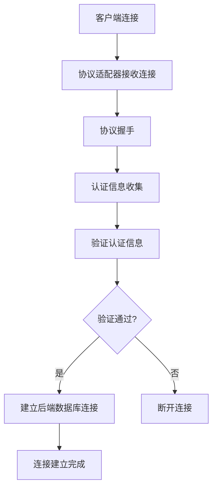
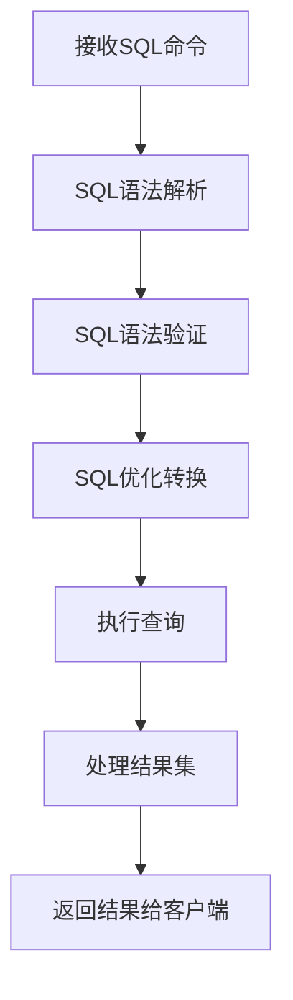
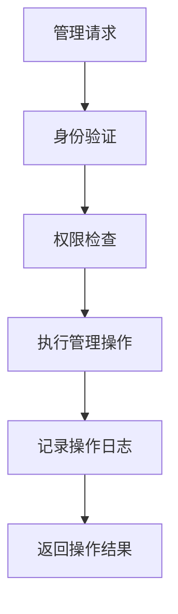

# 多协议数据库网关引擎概要设计文档

## 1. 引言

### 1.1 目的
本文档旨在描述多协议数据库网关引擎的概要设计，包括系统架构、核心组件、数据流和关键设计决策，为详细设计和实现提供指导。

### 1.2 范围
本设计涵盖以下内容：
- 系统整体架构设计
- 核心组件设计
- 数据流设计
- 部署架构设计
- 非功能性需求设计

## 2. 系统概述

### 2.1 系统背景
多协议数据库网关引擎是一个数据库协议代理系统，用于统一访问不同的数据库系统。它通过实现各种数据库协议，将客户端请求转换为相应数据库的原生查询，并将结果返回给客户端。

### 2.2 系统目标
- 实现多种数据库协议的统一接入
- 提供安全可靠的数据库连接代理
- 支持动态配置和扩展
- 提供完善的监控和管理功能

## 3. 系统架构设计

### 3.1 整体架构
系统采用分层架构设计，主要包括以下层次：

```
+------------------+     +---------------------+     +--------------------+
|   Client Apps    |<--->|  Gateway Engine     |<--->|  Backend Databases |
| (Various Protocols)    | (Protocol Handlers) |     | (Native Protocols) |
+------------------+     +----------+----------+     +---------+----------+
                                    |                          |
                                    v                          v
                         +----------+----------+    +----------+----------+
                         |   SQL Parser        |    | & Load Balancing    |
                         +----------+----------+    +---------------------+
                                    |
                                    v
                         +----------+----------+
                         |  Query Execution    |
                         |  & Result Mapping   |
                         +---------------------+
```

### 3.2 架构层次说明

#### 3.2.1 协议适配层
- 负责处理不同数据库协议的客户端连接
- 实现协议解析和客户端请求处理
- 包括MySQL、PostgreSQL、Oracle等协议适配器

#### 3.2.2 业务逻辑层
- SQL解析和验证
- 查询优化和转换
- 安全控制和审计

#### 3.2.3 数据访问层
- 数据库连接管理
- 查询执行和结果处理
- 连接池管理

#### 3.2.4 接入管理层
- RESTful API管理接口
- 命令行管理接口
- 系统监控和配置管理

## 4. 核心组件设计

### 4.1 协议适配器组件

#### 4.1.1 组件职责
- 处理特定数据库协议的客户端连接
- 实现协议握手和认证流程
- 转换协议数据包为内部请求

#### 4.1.2 接口设计
```java
public interface ProtocolAdapter {
    String getProtocolName();
    int getDefaultPort();
    void start();
    void stop();
    boolean isRunning();
}
```

#### 4.1.3 实现类
- MySqlProtocolAdapter：MySQL协议实现
- PostgreSqlProtocolAdapter：PostgreSQL协议实现（计划）
- OracleProtocolAdapter：Oracle协议实现（计划）

### 4.2 SQL解析器组件

#### 4.2.1 组件职责
- 解析SQL语句为抽象语法树(AST)
- 验证SQL语法正确性
- 提取SQL元数据信息
- 支持SQL方言转换

#### 4.2.2 接口设计
```java
public interface SqlParser {
    SQLStatement parse(String sql) throws SqlParseException;
    boolean validate(String sql);
    String[] extractTableNames(String sql);
    String translate(String sql, SqlDialect targetDialect);
}
```

#### 4.2.3 实现类
- DruidSqlParser：基于Druid的SQL解析器实现

### 4.3 数据库连接服务组件

#### 4.3.1 组件职责
- 管理到后端数据库的连接
- 实现连接池功能
- 处理连接生命周期

#### 4.3.2 接口设计
```java
@Service
public class DatabaseConnectionService {
    public Connection connectToDatabase(String url, String username, String password) throws SQLException;
    public void closeConnection(Connection connection);
}
```

### 4.4 网关控制器组件

#### 4.4.1 组件职责
- 提供RESTful管理接口
- 控制网关运行状态
- 提供系统监控信息

#### 4.4.2 接口设计
```java
@Component
public class GatewayController {
    public String startGateway();
    public String stopGateway();
    public String getStatus();
}
```

## 5. 数据流设计

### 5.1 客户端连接流程


### 5.2 SQL查询处理流程


### 5.3 系统管理流程


## 6. 部署架构设计

### 6.1 单节点部署
```
+--------------------------------------------------+
|                应用服务器                        |
|  +--------------------------------------------+  |
|  |       多协议数据库网关引擎                  |  |
|  |  +----------------+  +------------------+  |  |
|  |  | 协议适配器模块 |  | 业务逻辑处理模块 |  |  |
|  |  +----------------+  +------------------+  |  |
|  |  +----------------+  +------------------+  |  |
|  |  | 数据库连接模块 |  | 管理接口模块     |  |  |
|  |  +----------------+  +------------------+  |  |
|  +--------------------------------------------+  |
+--------------------------------------------------+
```

### 6.2 集群部署
```
+----------------+    +----------------+    +----------------+
|   负载均衡器    |    |   负载均衡器    |    |   负载均衡器    |
| (Load Balancer)|    | (Load Balancer)|    | (Load Balancer)|
+-------+--------+    +-------+--------+    +-------+--------+
        |                     |                     |
        v                     v                     v
+-------+--------+    +-------+--------+    +-------+--------+
| 网关节点1       |    | 网关节点2      |    | 网关节点N       |
| (Gateway Node) |    | (Gateway Node) |    | (Gateway Node) |
+-------+--------+    +-------+--------+    +-------+--------+
        |                     |                     |
        +----------+----------+----------+----------+
                   |                     |
                   v                     v
         +---------+--------+   +--------+---------+
         | 后端数据库集群    |   | 监控和配置中心    |
         +------------------+   +------------------+
```

## 7. 非功能性需求设计

### 7.1 性能需求
- 支持至少50000个并发连接
- SQL命令转发延迟小于10毫秒（局域网环境）
- 内存占用控制在512MB以内（默认配置）

### 7.2 可靠性需求
- 系统可用性达到99.9%
- 提供故障自动恢复机制
- 支持优雅停机和重启

### 7.3 安全性需求
- 支持TLS/SSL加密通信
- 提供SQL注入防护
- 实现基于角色的访问控制
- 敏感信息加密存储

### 7.4 可扩展性需求
- 支持水平扩展
- 插件化协议适配器设计
- 配置驱动的功能开关

### 7.5 可维护性需求
- 提供完善的监控接口
- 详细的日志记录
- 支持远程管理和配置
- 清晰的错误信息和诊断信息

## 8. 数据设计

### 8.1 配置数据
- 应用配置：存储在application.yml中
- 协议配置：各协议的端口、启用状态等
- 连接池配置：连接数、超时时间等参数

### 8.2 运行时数据
- 连接状态：当前活动连接数、连接详情
- 统计数据：请求数、错误数、响应时间等
- 缓存数据：SQL解析结果、连接信息等

### 8.3 日志数据
- 操作日志：用户操作记录
- 错误日志：系统错误和异常信息
- 审计日志：安全相关操作记录

## 9. 接口设计

### 9.1 外部接口

#### 9.1.1 协议接口
- MySQL协议接口（端口3306）
- PostgreSQL协议接口（端口5432，预留）
- Oracle协议接口（端口1521，预留）

#### 9.1.2 管理接口
- RESTful API接口（端口8080）
- 命令行接口

### 9.2 内部接口
- 组件间通过Spring依赖注入进行交互
- 使用Java接口定义组件契约
- 通过事件机制处理异步操作

## 10. 关键设计决策

### 10.1 技术选型决策
- 选择Spring Boot作为应用框架，提供快速开发和部署能力
- 采用阿里巴巴Druid作为SQL解析器，具备强大的SQL解析和分析能力
- 使用Java 17以利用最新的语言特性和性能改进

### 10.2 架构设计决策
- 采用分层架构，确保各层职责清晰、易于维护
- 使用接口抽象，提高系统的可扩展性和可测试性
- 实现协议适配器模式，支持多种数据库协议的灵活扩展

### 10.3 安全设计决策
- 认证信息不在日志中记录，防止敏感信息泄露
- 提供基于角色的访问控制，确保系统安全
- 支持TLS/SSL加密，保护数据传输安全

## 11. 风险与缓解措施

### 11.1 技术风险
- **风险**：协议实现复杂度高，可能存在兼容性问题
- **缓解措施**：参考官方协议文档，进行充分的兼容性测试

### 11.2 性能风险
- **风险**：高并发场景下可能出现性能瓶颈
- **缓解措施**：实现连接池管理，优化SQL解析性能

### 11.3 安全风险
- **风险**：可能存在SQL注入等安全漏洞
- **缓解措施**：使用成熟的SQL解析器，实现安全检查机制

## 12. 后续工作

### 12.1 待完善功能
- 实现PostgreSQL、Oracle等其他协议适配器
- 增强SQL方言转换能力
- 实现负载均衡和集群功能

### 12.2 性能优化
- 优化连接池管理策略
- 提升SQL解析性能
- 实现查询缓存机制

### 12.3 安全增强
- 实现完整的身份认证和授权机制
- 增强数据传输加密能力
- 提供更详细的审计日志功能